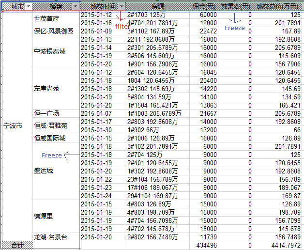

Using `Fluent API` to configure POCO excel behaviors, and then provides IEnumerable&lt;T&gt; have save to and load from excel functionalities.

# Features
- [x] Decouple the configuration from the POCO model by using `fluent api`.
- [x] Support POCO, so that if your mother langurage is Engilish, none any configurations;

The first features will be very useful for English not their mother language developers.

# Overview



# Get Started

The following demo codes come from [sample](samples), download and run it for more information.

## Using Package Manager Console to install FluentExcel

        PM> Install-Package FluentExcel
    
## Reference FluentExcel in code

        using FluentExcel;
    
## Use Fluent Api to configure POCO's excel behaviors

We can use `fluent api` to configure the model excel behaviors.

```csharp
        public class Report {
            public string City { get; set; }
            public string Building { get; set; }
            public DateTime HandleTime { get; set; }
            public string Broker { get; set; }
            public string Customer { get; set; }
            public string Room { get; set; }
            public decimal Brokerage { get; set; }
            public decimal Profits { get; set; }
        }

        /// <summary>
        /// Use fluent configuration api. (doesn't poison your POCO)
        /// </summary>
        static void FluentConfiguration() 
        {
            var fc = Excel.Setting.For<Report>();

            fc.HasStatistics("合计", "SUM", 6, 7)
              .HasFilter(firstColumn: 0, lastColumn: 2, firstRow: 0)
              .HasFreeze(columnSplit: 2,rowSplit: 1, leftMostColumn: 2, topMostRow: 1);

            fc.Property(r => r.City)
              .HasExcelIndex(0)
              .HasExcelTitle("城市")
              .IsMergeEnabled();

            fc.Property(r => r.Building)
              .HasExcelIndex(1)
              .HasExcelTitle("楼盘")
              .IsMergeEnabled();

            fc.Property(r => r.HandleTime)
              .HasExcelIndex(2)
              .HasExcelTitle("成交时间")
              .HasDataFormatter("yyyy-MM-dd HH:mm:ss");
            
            fc.Property(r => r.Broker)
              .HasExcelIndex(3)
              .HasExcelTitle("经纪人");
            
            fc.Property(r => r.Customer)
              .HasExcelIndex(4)
              .HasExcelTitle("客户");

            fc.Property(r => r.Room)
              .HasExcelIndex(5)
              .HasExcelTitle("房源");

            fc.Property(r => r.Brokerage)
              .HasExcelIndex(6)
              .HasExcelTitle("佣金(元)");

            fc.Property(r => r.Profits)
              .HasExcelIndex(7)
              .HasExcelTitle("收益(元)");
        }
```

## Export POCO to excel & Load IEnumerable&lt;T&gt; from excel.

```csharp
using System;
using FluentExcel;

namespace samples
{
    class Program
    {
        static void Main(string[] args)
        {
            // global call this
            FluentConfiguration();

            var len = 10;
            var reports = new Report[len];
            for (int i = 0; i < len; i++)
            {
                reports[i] = new Report
                {
                    City = "ningbo",
                    Building = "世茂首府",
                    HandleTime = new DateTime(2015, 11, 23),
                    Broker = "rigofunc 18957139**7",
                    Customer = "rigofunc 18957139**7",
                    Room = "2#1703",
                    Brokerage = 125M,
                    Profits = 25m
                };
            }

            var excelFile = @"/Users/rigofunc/Documents/sample.xlsx";

            // save to excel file
            reports.ToExcel(excelFile);

            // load from excel
            var loadFromExcel = Excel.Load<Report>(excelFile);
        }

        /// <summary>
        /// Use fluent configuration api. (doesn't poison your POCO)
        /// </summary>
        static void FluentConfiguration() 
        {
            var fc = Excel.Setting.For<Report>();

            fc.HasStatistics("合计", "SUM", 6, 7)
              .HasFilter(firstColumn: 0, lastColumn: 2, firstRow: 0)
              .HasFreeze(columnSplit: 2,rowSplit: 1, leftMostColumn: 2, topMostRow: 1);

            fc.Property(r => r.City)
              .HasExcelIndex(0)
              .HasExcelTitle("城市")
              .IsMergeEnabled();

            fc.Property(r => r.Building)
              .HasExcelIndex(1)
              .HasExcelTitle("楼盘")
              .IsMergeEnabled();

            fc.Property(r => r.HandleTime)
              .HasExcelIndex(2)
              .HasExcelTitle("成交时间")
              .HasDataFormatter("yyyy-MM-dd");
            
            fc.Property(r => r.Broker)
              .HasExcelIndex(3)
              .HasExcelTitle("经纪人");
            
            fc.Property(r => r.Customer)
              .HasExcelIndex(4)
              .HasExcelTitle("客户");

            fc.Property(r => r.Room)
              .HasExcelIndex(5)
              .HasExcelTitle("房源");

            fc.Property(r => r.Brokerage)
              .HasExcelIndex(6)
              .HasExcelTitle("佣金(元)");

            fc.Property(r => r.Profits)
              .HasExcelIndex(7)
              .HasExcelTitle("收益(元)");
        }
    }
}
 ```       
